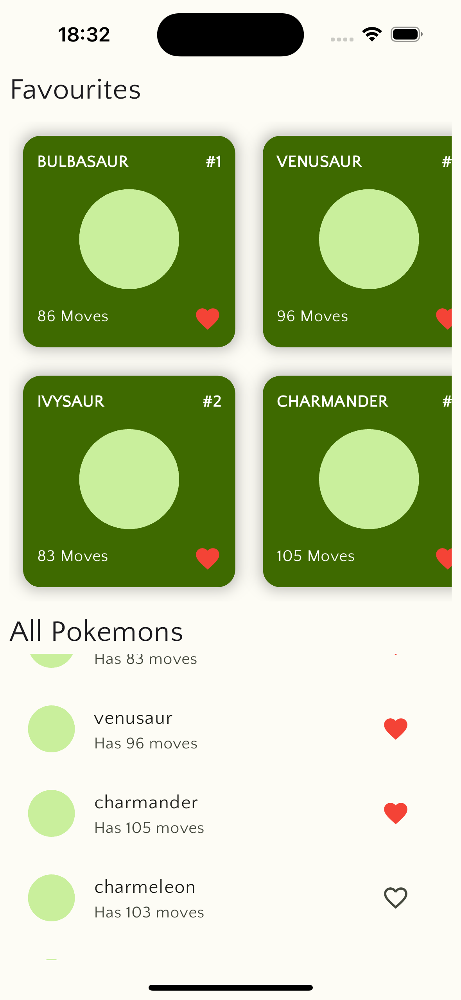
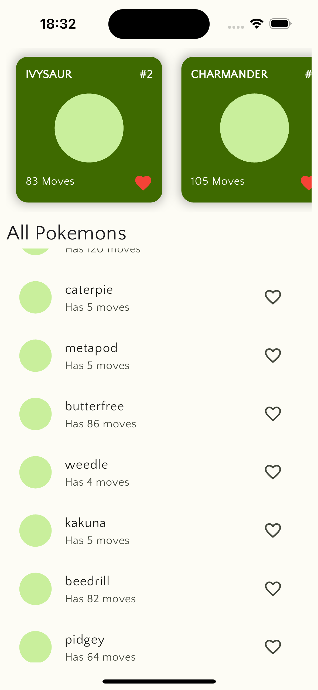

# simonpokedex

A simple Pokedex app built with flutter and river-pod

In this example project i used riverpod to perform api calls utilizing riverpod caching,
i also used riverpod state notifier for state management and pagination
i also used GetIt for dependency injection

<table>
  <tr>
    <td></td>
    <td></td>
  </tr>
</table>
